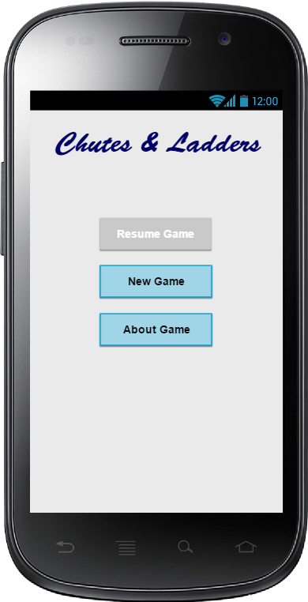
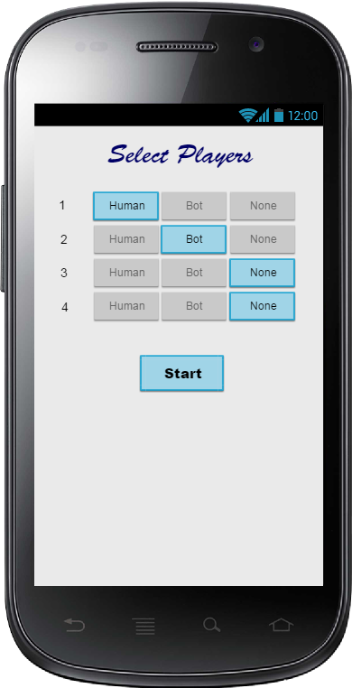

# Chutes And Ladders
A simple back-end code in Java for Chutes and Ladders game.  
Have made certain [assumptions](#ui-assumptions) regarding how the user would interact with the (hypothetical) UI during the life cycle of the game.

## Simulation
The project also contains a simulation for the game that can be run in following ways:

#### Using gradle wrapper
From the root directory
1. Run command `./gradlew build` to build
2. Run command `./gradlew run` to run the simulation

#### Directly running the main method
1. Run the main method in `com.rezilience.runner.SimulateGame` (assuming you have built the code already) 

### Simulator O/p
Each line in o/p indicates a move. Some examples follow:

`1: Eric: 3 --> 8` => (sr. no): (player name): (start) --> (end)  
This means, Eric moved from 3 to 8 by scoring a 5 on the spinner 

`7: Eric: 6 --> 9 --LADDER--> 31`  
Eric moved from 6 to 9 scoring a 3, encountered a ladder and jumped to 31.
Likewise, there can be a CHUTE instead of LADDER. 

`61: Paul: 99 -x-> 105 --> 99`  
Paul scored a 6 but 6 moves not possible from 99 and hence stayed at 99.

`64: Eric: 97 --> 100`  
`The winner is Eric!`
Voila! Eric reached 100 and won the game.

## IntelliJ Setup
1. Check out in a local directory
2. In IntelliJ, select `File -> New -> Project from Existing Sources...`
3. Select `build.gradle` from the check out location and click `OK`
4. In IntelliJ Settings, enable Annotation Processing for Lombok to work   

## Design Philosophy

### UI Assumptions
The API is designed considering below UI and behavior in mind  

  

1. User can resume an existing game or start new game
2. User can select 2 to 4 players and decide which of them are bots   
2. At any time, UI can get basic game info like the order of turns of players, positions of players, etc.  
3. UI process can allow human interaction (like rolling the dice, etc.) before executing the move  
4. UI can prompt the user to exit or continue with remaining players after a player wins  

### API and Technical Details
`com.rezilience.chutesnladders.model` package has all the models like Player, Board, Spinner, Block, etc.  
`com.rezilience.chutesnladders.Game` is the main Game class which is configured to be a singleton since we don't expect multiple instances of game.    
`Game.setupNewGame` => initialize the players (assigning them turns, ids, start positions, etc)  
`Game.clearCurrentGame()` => reset `game` state, so that new game can be set up  
`Game.nexMove()` => execute next move

## TODO
- [x] Add more design details (structure of code, main interfaces, etc) to README
- [ ] Comprehensive test cases with coverage report
- [ ] Enhance functionality, features like if you score a 6, you play again
- [ ] Make the design more generic, so that its easier to introduce say.. another game like Ludo along with it
